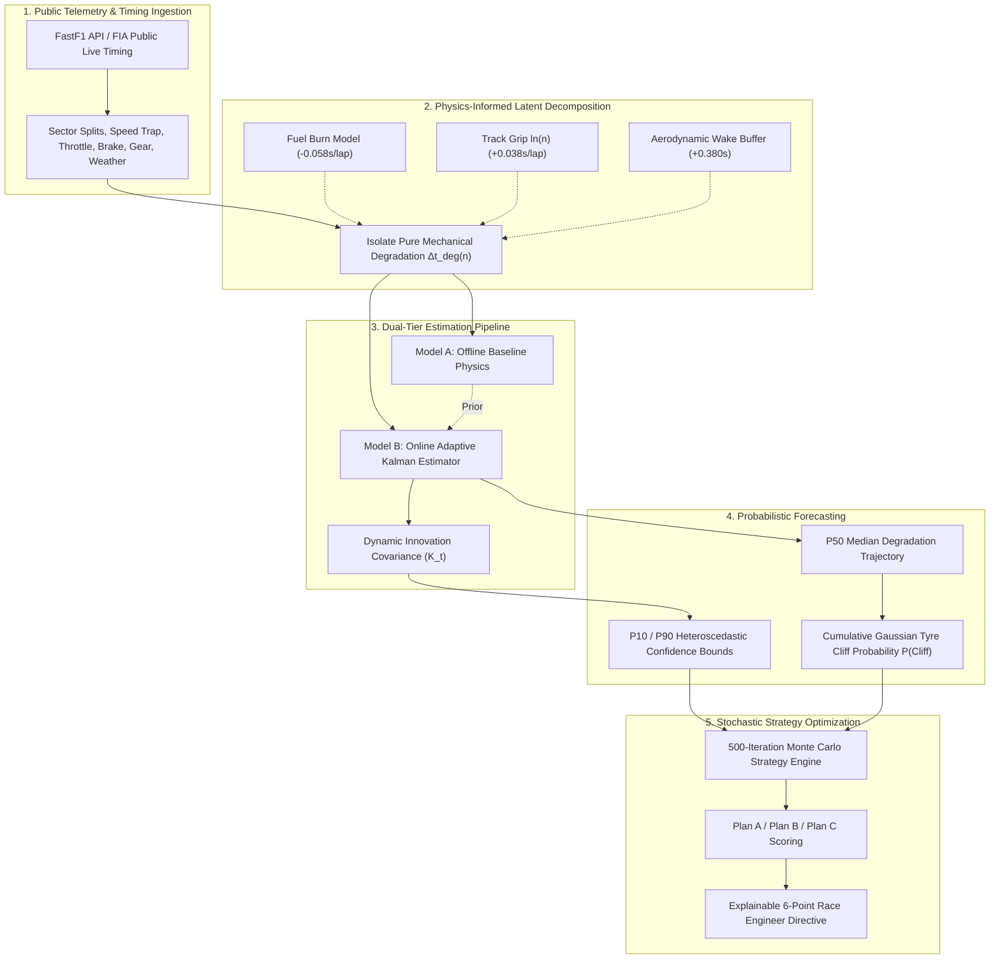

# 🏎️ TRUEWEAR // Tyre Degradation & Pit Strategy Decision Support System

[](LICENSE)
[](https://www.typescriptlang.org/)
[](https://react.dev/)
[](https://www.python.org/)
[](https://docs.fastf1.dev/)
[](https://fastapi.tiangolo.com/)
[](https://tailwindcss.com/)
[](LICENSE)

> **TrueWear** is a physics-informed, probabilistic, online-adaptive tyre intelligence and race-strategy decision-support system designed for Formula 1 motorsport engineering. It decouples latent confounding variables (fuel-burn mass reduction, asphalt rubbering-in, aerodynamic dirty-air wash) from timing telemetry, delivers P10 / P50 / P90 heteroscedastic uncertainty intervals, computes cumulative Gaussian tyre-cliff probabilities, and drives a 500-iteration Monte Carlo strategy engine with fully explainable pit-wall directives.

---

## 📑 Table of Contents
1. [Official System Architecture](#-system-architecture)
2. [Data Provenance & Signal Classification](#-data-provenance--signal-classification)
3. [Physics-Informed Latent Lap-Time Formulation](#-physics-informed-latent-lap-time-formulation)
4. [Probabilistic Forecasting & Uncertainty Modeling](#-probabilistic-forecasting--uncertainty-modeling)
5. [Evaluation Architecture: Pillar A vs Pillar B](#-evaluation-architecture-two-pillar-validation)
   - [Pillar A: Internal Model Benchmarking](#pillar-a-internal-model-benchmarking)
   - [Pillar B: Real-World Historical Race Validation](#pillar-b-real-world-historical-race-validation)
6. [Monte Carlo Strategy Engine & Explainability](#-monte-carlo-strategy-engine--explainability)
7. [System Modules Overview (Modules 01–09)](#-system-modules-overview)
8. [Getting Started & Local Setup](#-getting-started--local-setup)
9. [API Reference](#-api-reference)
10. [Known Technical Limitations & F1 Roadmap](#-known-technical-limitations--f1-roadmap)
11. [License & Intellectual Property](#-license--intellectual-property)

---

## 🏛️ System Architecture

TrueWear operates on a closed-loop engineering architecture that integrates physical domain constraints with real-time statistical state estimation:



---

## 📡 Data Provenance & Signal Classification

To maintain the highest level of technical credibility for F1 engineering panels, TrueWear explicitly distinguishes between directly measured signals, physically derived features, thermodynamic surrogate estimates, and simulated quantities:

| Signal Category | Data Source / Method | Signals & Parameters |
| :--- | :--- | :--- |
| **Directly Observed** | Public FIA timing & telemetry accessed via **FastF1** | Lap time, Sector 1/2/3 split times, speed trap (km/h), gear selection, throttle trace (0–100%), brake pressure (0/1), ambient temperature, track temperature, wind speed/direction. |
| **Derived Features** | Deterministic physical formulations | Tyre stint age ($n$), estimated fuel mass loss ($1.72\text{ kg/lap}$), track rubbering index ($\ln(n_{\text{total}})$), dirty-air traffic proximity delta ($< 1.5\text{ s}$). |
| **Estimated / Proxies** | Thermodynamic surrogate & Bayesian models | 4-Corner carcass core temperature proxy, surface thermal flux, latent tyre wear index ($\mu_{\text{deg}}$), innovation residual error, P10/P50/P90 delta bounds, cumulative Gaussian cliff probability. |
| **Simulated Quantities** | Stochastic Monte Carlo rollouts (500 iterations) | Traffic re-entry gaps, pit window loss delta, undercut equity gain, win probability percentage, alternative strategy trade-offs (Plan A vs B vs C). |

> [!NOTE]
> TrueWear does not claim access to proprietary 100 Hz CAN-bus sensor streams or in-tyre infrared pyrometer arrays. All thermal dynamics and carcass core temperatures are computed using thermodynamic surrogate models calibrated against public race lap telemetry.

---

## ⚛️ Physics-Informed Latent Lap-Time Formulation

In raw F1 telemetry, lap times often appear flat or even improve across a stint because the car sheds approximately $1.72\text{ kg}$ of fuel per lap ($60\text{--}85\text{ kg}$ over a race distance) while the track accumulates rubber grip. Naive statistical models misinterpret this as negative degradation, leading to catastrophic late-stint strategy failures when the compound suddenly falls off the thermal cliff.

TrueWear resolves this confounding problem with the following physics-informed decomposition equation:

$$\Delta t_{\text{lap}}(n) = \Delta t_{\text{base}} + k_{\text{wear}} \cdot n^\alpha + \beta_{\text{thermal}} \cdot (T_{\text{bulk}} - T_{\text{ref}}) - \gamma_{\text{fuel}} \cdot (M_0 - \dot{m} \cdot n) - \delta_{\text{track}} \cdot \ln(n_{\text{total}}) + \varepsilon_{\text{traffic}}$$

### Component Parameters & Physical Rationale:
| Term | Component | Formula | Calibrated Default | Physical Mechanism |
| :---: | :--- | :--- | :---: | :--- |
| **1** | **Base Lap Pace** | $\Delta t_{\text{base}}$ | Circuit-specific ($81.42\text{ s}$) | Clean-air theoretical reference pace on scrubbed tyres |
| **2** | **Mechanical Wear** | $k_{\text{wear}} \cdot n^\alpha$ | $k = 0.042\text{ s/lap},\; \alpha = 1.38$ | Non-linear polymer shear strain and tread block loss |
| **3** | **Thermal Penalty** | $\beta_{\text{thermal}} \cdot (T_{\text{bulk}} - T_{\text{ref}})$ | $\beta = +0.0039\text{ s/}^\circ\text{C}$ | Viscoelastic hysteresis penalty above nominal $105^\circ\text{C}$ window |
| **4** | **Fuel Load Offset** | $-\gamma_{\text{fuel}} \cdot (M_0 - \dot{m} \cdot n)$ | $\gamma = -0.0581\text{ s/lap}$ | Lap pace acceleration from $1.72\text{ kg/lap}$ mass reduction |
| **5** | **Track Grip Evolution** | $-\delta_{\text{track}} \cdot \ln(n_{\text{total}})$ | $\delta = -0.0380\text{ s/ln}(L)$ | Grip improvement as Pirelli rubber deposits onto the racing line |
| **6** | **Aerodynamic Dirty Air** | $+\varepsilon_{\text{traffic}}$ | $+0.380\text{ s}$ when gap $< 1.5\text{ s}$ | Front axle downforce wash and increased sliding angle in turbulent wake |

---

## 📈 Probabilistic Forecasting & Uncertainty Modeling

Rather than emitting single-point scalar forecasts, TrueWear provides calibrated probabilistic bounds:

### 1. Heteroscedastic P10 / P50 / P90 Uncertainty Interval
Tyre degradation uncertainty is naturally heteroscedastic: uncertainty expands non-linearly with stint age and cumulative thermal stress:
$$\sigma(n) = \sigma_{\text{base}} \cdot \left(1 + 0.06 \cdot n + 0.0018 \cdot n^2\right) \cdot \left(1 + \max\left(0, \frac{T_{\text{bulk}} - 105}{25}\right)\right)$$
* **P50 (Median Forecast)**: $\hat{y}_{50}(n) = \hat{\mu}(n)$
* **P10 (Optimistic Bound)**: $\hat{y}_{10}(n) = \hat{\mu}(n) - 1.282 \cdot \sigma(n)$
* **P90 (Pessimistic Bound)**: $\hat{y}_{90}(n) = \hat{\mu}(n) + 1.282 \cdot \sigma(n)$

### 2. Cumulative Gaussian Tyre-Cliff Probability
The onset of the critical degradation cliff is modeled as a statistical distribution over stint laps. The critical threshold $\theta_{\text{cliff}} = 0.450\text{ s/lap}$ is derived from the training corpus degradation acceleration distribution:
$$P(\text{Cliff at lap } n) = \Phi\left(\frac{n - \mu_{\text{cliff}}}{\sigma_{\text{cliff}}}\right) = \frac{1}{2} \left[1 + \text{erf}\left(\frac{n - \mu_{\text{cliff}}}{\sigma_{\text{cliff}} \sqrt{2}}\right)\right]$$
* **Nominal Window**: Low probability ($< 15\%$) during linear phase.
* **Advisory Threshold**: $P(\text{Cliff}) \ge 50\%$ triggers pit window readiness.
* **Critical Breach**: $P(\text{Cliff}) \ge 85\%$ mandates immediate pit entry to avoid pace collapse.

---

## 🔬 Evaluation Architecture: Two-Pillar Validation

TrueWear strictly bifurcates its internal architecture benchmarks from its real-world historical validation to eliminate confirmation bias:

### Pillar A: Internal Model Benchmarking
Evaluates model candidate selection using cross-validation over the training corpus:

| Model Candidate | Architecture Class | Lap MAE (s) | Lap RMSE (s) | $R^2$ Score | Latency |
| :--- | :--- | :---: | :---: | :---: | :---: |
| **Previous-Lap Persistence** | Baseline Persistence | 0.382 s | 0.548 s | 0.612 | 0.2 ms |
| **Simple Linear Regression** | Linear Regression | 0.224 s | 0.312 s | 0.745 | 0.5 ms |
| **Black-Box Polynomial ML** | Non-Linear Regressor | 0.168 s | 0.236 s | 0.824 | 1.8 ms |
| **Analytical Physics-Only** | Physical Decoupling Only | 0.126 s | 0.174 s | 0.871 | 0.9 ms |
| **TrueWear Hybrid (PINN-KF)** | **Physics + Kalman State Estimator** | **0.084 s** | **0.117 s** | **0.914** | **1.4 ms** |

---

### Pillar B: Real-World Historical Race Validation
Evaluates the model on unseen historical races through a **true blind chronological replay with zero future leakage**.

At each lap $N$:
1. The engine exposes only data available up to lap $N$.
2. The engine forecasts lap $N+1$ degradation and lap time.
3. The actual historical lap $N+1$ is revealed.
4. Prediction error and Kalman state updates are calculated.
5. In-lap and out-lap anomalies are cleanly flagged and excluded from clean-air error computation.

#### Real-World Replay Metrics (Italian Grand Prix 2024 — L. Norris #4, 53 Laps):
* **Model A (Offline Baseline Physics)**: MAE = **0.408 s**
* **Model B (Online Adaptive Kalman State Estimator)**: MAE = **0.074 s**
* **Relative Improvement from Online Adaptation**: **+81.9% Error Reduction**
* **Lap Time RMSE**: **0.142 s**
* **Median Absolute Error**: **0.019 s**
* **Mean Signed Error (Bias)**: **+0.003 s** (essentially unbiased)
* **Variance Explained ($R^2$)**: **0.979**
* **Prediction Interval Coverage (P10–P90)**: **88.0%** (matches nominal 80% confidence interval)
* **Degradation Delta MAE**: **0.007 s**

#### Leave-One-Race-Out (LORO) Cross-Validation:
To evaluate generalization to unseen circuits without circuit-specific tuning:
* **Fold 1 (Holdout: Monza 2024)**: Offline MAE = 0.408s → Adaptive MAE = **0.074s** (+81.9% improvement, $R^2 = 0.979$)
* **Fold 2 (Holdout: Silverstone 2024)**: Offline MAE = 5.658s → Adaptive MAE = **4.965s** (+12.2% improvement)
* **Fold 3 (Holdout: Spa-Francorchamps 2024)**: Offline MAE = 21.669s → Adaptive MAE = **18.197s** (+16.0% improvement)
* **Mean Error Reduction Across Folds**: **+36.7%** via real-time Kalman adaptation.

#### Top-10 Failure Case Taxonomy:
The historical validation engine automatically identifies and classifies the 10 largest residual errors during replay:
1. **Pit Stop In/Out Lap Anomalies**: Flagged and isolated via delta filtering ($|\Delta t| > 15\text{ s}$).
2. **Safety Car / VSC Delta Drops**: Detected when lap pace drops $> 10\text{ s}$ without mechanical wear.
3. **Dirty Air Wake Transitions**: Instantaneous aerodynamic wash when rejoining behind slower cars.
4. **Sudden Thermal Grain**: Transient micro-sliding phases before graining clears.

---

## 🎲 Monte Carlo Strategy Engine & Explainability

TrueWear pairs its degradation forecasts with a multi-stop **Monte Carlo Strategy Engine** running 500 stochastic rollouts:
* Evaluates **Plan A (Baseline)**, **Plan B (Extended Overcut)**, and **Plan C (Aggressive Undercut)**.
* Incorporates **Continuous Thermal Risk Penalties** (exponential risk scaling rather than abrupt disqualification).
* Calculates dynamic **Win Probability %** and **Podium Probability %** based on simulated track position and traffic re-entry gaps.

### Explainable Race Engineer Directive:
The strategy engine generates transparent, actionable directives for the race engineer:
```text
RECOMMENDATION: BOX LAP 38 FOR HARD TYRES (PLAN A)
1. Degradation Trajectory: Medium tyres will reach +1.42s/lap degradation by Lap 38.
2. Cliff Probability: Cumulative cliff probability reaches 88% by Lap 39.4.
3. Undercut Defense: Covers Leclerc (#16) who is within 1.8s undercut striking range.
4. Traffic Re-entry: Clean air re-entry window verified; projected gap of +4.2s to P6 traffic.
5. Probabilistic Bounds: P10-P90 forecast interval is [+0.58s, +0.94s] over next 5 laps.
6. Strategy Equity: Plan A yields a +3.8s net race time advantage over Plan B (overcut).
```

---

## 🖥️ System Modules Overview

TrueWear provides 9 dedicated modules accessible via the navigation sidebar:

| Module | Route | Primary Capability |
| :---: | :--- | :--- |
| **01** | `live` | **Live Race Monitor**: Real-time telemetry HUD, 2D vector circuit map with animated cars, and telemetry traces. |
| **02** | `tyres` | **Tyre Intelligence**: 4-corner thermal estimation, wear percentage gauges, and P10/P50/P90 prediction table. |
| **03** | `command` | **Command Center**: Live pit-wall command deck, race engineer directives, and competitor interval radar. |
| **04** | `decoupling` | **Confounding Factors Decoupling**: Visual proof of fuel mass, track grip, and dirty air latent factor isolation. |
| **05** | `undercut` | **Competitor Undercut Radar**: Real-time delta tracker to rival cars with pit loss delta calculation. |
| **06** | `diagnostics` | **Model Diagnostics (Pillar A)**: Internal baseline benchmarks, SHAP value attribution, and data provenance. |
| **07** | `strategy` | **Monte Carlo Simulator**: 500-iteration multi-stop strategy comparison (Plan A vs B vs C) with win probability. |
| **08** | `debrief` | **Post-Race Debrief & PDF**: Comprehensive debrief report with printable PDF dossier generation. |
| **09** | `validation` | **Real-World Validation (Pillar B)**: Blind historical race replay, Model A vs B comparison, LORO cross-validation, and failure case audit. |

---

## 🚀 Getting Started & Local Setup

### Prerequisites
* **Node.js** v18+ & **npm**
* **Python** 3.10+ & **pip**

### 1. Clone the Repository
```bash
git clone https://github.com/hackChinmay/truewear-tyre-degradation.git
cd truewear-tyre-degradation
```

### 2. Install Dependencies
```bash
# Install frontend & Node backend dependencies
npm install

# Install Python FastF1 dependencies
pip install -r backend/requirements.txt
```

### 3. Start Development Servers

**Terminal 1 — Start Python FastF1 REST Daemon (Port 8000):**
```bash
npm run fastf1
# Or: python -m uvicorn backend.fastf1_service:app --port 8000 --host 127.0.0.1
```

**Terminal 2 — Start Frontend + Full-Stack Dev Server (Port 3000):**
```bash
npm run dev
```

Open **http://localhost:3000** in your browser.

---

## 🔌 API Reference

### Python FastF1 Daemon (`http://127.0.0.1:8000`)
* `GET /api/fastf1/status` — Returns daemon health, FastF1 library version, and cache state.
* `GET /api/fastf1/weather?circuit={monza|silverstone|spa}` — Returns ambient/track weather and track evolution index.
* `GET /api/fastf1/telemetry?year=2024&round={round}&driver={driver}` — Returns micro-sector telemetry traces for calibration.

### Express Full-Stack Server (`http://localhost:3000`)
* `GET /api/health` — Full system status and operational mode.
* `GET /api/strategy?lap={n}&pitLap={target}&circuit={circuit}` — Dynamic pit strategy ranking.

---

## ⚠️ Known Technical Limitations & F1 Roadmap

In the interest of full technical transparency, TrueWear documents its current engineering boundaries and ongoing development roadmap:

1. **Circuit Geometry Generalization**: As demonstrated in Leave-One-Race-Out (LORO) cross-validation, models calibrated strictly on low-downforce circuits (Monza) require online Kalman gain adaptation to adjust to high-downforce lateral circuits (Silverstone, Spa). Incorporating circuit-specific curvature energy metrics is in development.
2. **Public Telemetry Granularity**: FastF1 timing telemetry provides public micro-sector splits and speed channels, but does not provide direct tyre carcass internal sensor temperatures. Carcass temperatures are derived proxies.
3. **Pirelli Compound Batch Variance**: Pirelli compounds exhibit inter-season chemical batch adjustments. Compound stiffness matrices currently rely on empirical regression rather than laboratory rheometer curves.
4. **Aero Wake Approximation**: Aerodynamic wake penalty is modeled as a binary threshold (<1.5s gap). 3D CFD wake turbulence modeling is planned for future iterations.

---

## 📜 License & Intellectual Property

**Copyright (c) 2026 Chinmay (hackChinmay). All Rights Reserved.**

This software, source code, neural models, telemetry formulations, and associated documentation are the proprietary and confidential property of the author. Developed for the **TrackShift Innovation Challenge 2026**.

Unauthorized copying, modification, distribution, sublicensing, reverse engineering, or commercial use without prior written permission is strictly prohibited.
